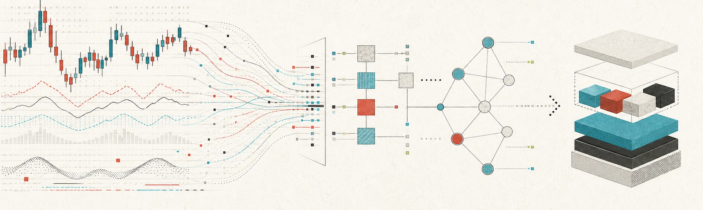

<picture>
  <source media="(prefers-color-scheme: dark)" srcset="./assets/profile-banner-dark.webp">
  <source media="(prefers-color-scheme: light)" srcset="./assets/profile-banner-light.webp">
  
</picture>

# Oliver Silas

**Trader · Independent Builder · AI Product Builder**

Reading signals. Building systems. Shipping useful software.

## Where I work

| Markets | Products | Systems |
| --- | --- | --- |
| Find signal in uncertainty. | Turn emerging capabilities into useful tools. | Build workflows that stay dependable as they grow. |

My work sits at the intersection of market judgment, AI-native product design,
and pragmatic engineering. I care less about demos and more about the difficult
last mile: making new technology clear, reliable, and economically useful.

## Current focus

- Building **AI-native products** across creative media and developer tooling.
- Designing **agentic workflows** that replace repetitive operations with reviewable systems.
- Growing **lean software businesses** through fast feedback and disciplined execution.

## Selected work

### [terniq](https://github.com/Oliver-Silas/terniq)

A Codex-native workflow plugin for serious software work. It brings planning,
implementation, and verification into one structured engineering loop.

`Codex` `Agent workflows` `Shell` `Engineering systems`

## Working stack

  
  
  
  
  
  

## Principles

**Signal over noise.** Start from evidence, not hype.

**Products over prototypes.** A useful release teaches more than a perfect plan.

**Simple over clever.** The best system is the smallest one that survives reality.

### Markets teach attention. Engineering teaches precision.

Currently exploring AI products, developer tooling, and systems that compound.

